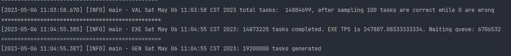
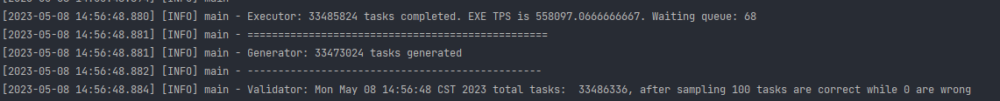
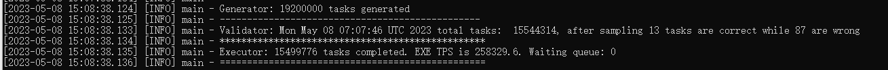
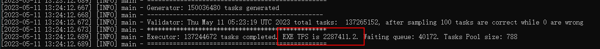

# 高并发编程题

### 【第1次设计与测试】

1. 并发度：本机 6w TPS
2. 使用的关键技术点：   
   1. TCP 传输的 为Task对象，每次发送一个
   2. 计算线程使用 newFixedThreadPool
3. 测试记录：
   
   

### 【第2次设计与测试】

1. 并发度：本机 12w TPS
2. 改进技术点：   ==主要改进计算部分以及线程同步==
   1. 利用位运算将sha256计算结果转为字符串，而不是format
      ```java
      private static StringBuilder getRes(byte[] bytes) {
              StringBuilder res;
              res = new StringBuilder();
              for (byte b : bytes) {
                  // 1.取出字节b的高四位的数值并追加
                  // 把高四位向右移四位，与 0x0f运算得出高四位的数值
                  res.append(HEX.charAt((b >> 4) & 0x0f));
                  // 2.取出低四位的值并追加
                  // 直接与 0x0f运算得出低四位的数值
                  res.append(HEX.charAt(b & 0x0f));
              }
              return res;
          }
      ```
   2. 改进线程池，变为 ThreadPoolExecutor，人为设定参数，减少线程上下文切换。
      ```java
      threadPool = new ThreadPoolExecutor(
                          CORE_POOL_SIZE,
                          CORE_POOL_SIZE,
                          60,
                          TimeUnit.SECONDS,
                          new LinkedBlockingDeque<>(10240000),
                          Executors.defaultThreadFactory(),
                          new ThreadPoolExecutor.DiscardPolicy());
      ```
   3. 减少线程对同一个资源的抢夺，例如：Executor 取消利用 AtomicLong计数，而是通过线程池自带的任务完成数
3. 测试记录


### 【第3次设计与测试】

1. 并发度：TPS 本机 24w 服务器16w
2. 改进技术点： ==  主要改进TCP传输任务部分==
   1. 取消 传输 Task 对象， 每次传输一个batch的计算任务。
   2. 利用 BufferedWriter 和 BufferedReader 传输任务，并控制 flush的刷新频率。
      
      ==注意：很大的缺点：传输的是字符串，因此接收方也是字符串会导致速度较慢，并且会频繁GC==
   ```java
   StringBuilder tasks = new StringBuilder();
   for (int i = 0; i < BATCH_SIZE; i++) {
       long id = next();
       int x = generateNumber();
       int y = generateNumber();
       tasks.append(id).append("@").append(x).append("@").append(y).append("@");
   }
   try {
       bw.write(tasks.toString());
       bw.newLine();
       bw.flush();
       synchronized (this) {
           if (this.cnt.addAndGet(BATCH_SIZE) >= tasksPerSeconds * 60) {
               System.out.println("Pause generating tasks");
               wait();
               System.out.println("restart to generate tasks");
           }
       }
   } catch (Exception e) {
       log.error("while generating:", e);
   }
   ```
3. 测试记录
   
   

### 【第4次设计与测试】

1. 并发度：TPS 本机 50w , 服务器26w
   
   本机：
   
   
   
   服务器：
   
   
2. 改进点：
   1. 生成任务控制力度改为 1s，并且用字节流传输。==（在window验证不会错误，在linux则错误）==
      ```java
      public void generateTasks() {
          for (int cnt = 0; cnt < nTasksPerSecond; cnt += BATCH_SIZE) {
              try {
                  for (int i = 0; i < BATCH_SIZE; i++) {
                      long id = next();
                      int x = generateNumber();
                      int y = generateNumber();
                      writeBuffer.putLong(id);
                      writeBuffer.putShort((short) (x & 0xffff));  // 通过(short) (x & 0xFFFF)操作得到低16位
                      writeBuffer.putShort((short) (y & 0xffff));
                  }
                  outputStream.write(writeBuffer.array());
                  outputStream.flush();
                  writeBuffer.clear();
              } catch (Exception e) {
                  log.error("while generating:", e);
              }
              nTasksPerMin.add(BATCH_SIZE);
          }
      }
      ```
   2. 执行器的处理计算任务和发送结果代码解耦，独立一个线程专门发送结果给验证器。
      ```java
      //批量接受代码
      public void receiveAndHandleTasks() {
          try {
              for (; ; ) {
                  inputStream.read(readBuffer.array());
                  for (int i = 0; i < BATCH_SIZE; i++) {
                      long id = readBuffer.getLong();
                      int x = readBuffer.getShort() & 0xffff;
                      int y = readBuffer.getShort() & 0xffff;
                      threadPool.execute(new ExecuteTasks(id, x, y));
                  }
                  readBuffer.clear();
              }
          } catch (IOException e) {
              log.error("Executor: ", e);
              Utils.close(server, socket, udpSocket);
          }
      }
      
      
      // ExecuteTasks 多线程计算的代码
      @Override
      public void run() {
          String res = Utils.fastPow(x, y);
          try {
              byte[] sha256 = Utils.getSha256TenTimes(res);
              byte[] tasks = Utils.task2Bytes(id, x, y, sha256);
              taskQueue.offer(tasks);
          } catch (NoSuchAlgorithmException e) {
              throw new RuntimeException(e);
          }
      }
      
      // 批量发送结果给验证者的代码
      public void sendTasks2Validator() {
          int cnt = 0;
          for (; ; ) {
              if (taskQueue.isEmpty()) {
                  continue;
              }
              byte[] task = taskQueue.poll();
              writeBuffer.put(task);
              if (++cnt == BATCH_SIZE) {
                  try {
                      outputStream.write(writeBuffer.array());
                      outputStream.flush();
                      writeBuffer.clear();
                      nTasksPerMin.add(cnt);
                      cnt = 0;
                  } catch (IOException e) {
                      log.error("Executor send: ", e);
                  }
              }
          }
      }
      ```

### 【第5次设计与测试】

1. 并发度：TPS  服务器228w
   
   
2. 改进点：
   1. 将执行计算任务改为一次执行一个batch的任务，batch为2048.
      ```java
      public void receiveAndHandleTasks() {
          try {
              for (; ; ) {
                  inputStream.readFully(readBuffer.array());
                  ExecuteTasks tasks = tasksPool.poll(); // 内存池
                  if (tasks == null) {
                      tasks = new ExecuteTasks(BATCH_SIZE);
                  }
                  for (int i = 0; i < BATCH_SIZE; i++) {
                      long id = readBuffer.getLong();
                      int x = readBuffer.getShort() & 0xffff;
                      int y = readBuffer.getShort() & 0xffff;
                      tasks.putOneTask(id, x, y);
                  }
                  threadPool.execute(tasks);
                  readBuffer.clear();
              }
          } catch (Exception e) {
              log.error("Executor: ", e);
              Utils.close(server, socket, udpSocket);
          }
      }
      ```
   2.  利用对象池优化，减少GC。

# 心得

1. 快速搭建baseline，确定传输任务，计算各个任务极限所在，接下去的改进也会更有目标参照物。
2. ==定位并发瓶颈所在：==（**能够定位到问题是解决问题的关键**）
   1. 一开始，主观认为并发瓶颈在 Executor 的计算，然而优化到一个程度，TPS提高并不明显；
   2. 随后利用 IDEA 的 Profiler，定位每一步耗时，把耗时的加以改进，TPS才得以突破；
   3. ==定位到瓶颈在于TCP传输，利用 BufferedWriter 和 BufferedReader 来传输一个 batch 计算任务，TPS突破为24w。==
   4. ==改为传输字节流，本机并发位50w，linux出现任务计算错误，已解决，read并不会读取完整的数据，可以使用readFully 或者自己实现==
   5. ==最后瓶颈在于网络带宽==，这个应该在搭建baseline的时候就应该发现。
3. 控制程序不崩溃，**这里原因都是 new 对象太多**
   1. ==任务产生 比 Executor 接受速度快太多，本机运行一段时间TPS会下降乃至为0==，==修改为直接传输字符流，只是缓解。==
   2. ==每个线程 执行 batch个 任务时候会 OOM==，对象要尽量复用。
4. ==应该详细记录每次改进与测试的关键点：==
   1. 刚开始很多次的测试并没有详细记录，这导致复盘的时候不够清晰。
   2. 每次改进都应该测试一下，看是否有效并且记录。
   3. 踩的坑，和改进中犯的错也应该详细记录。
5. 要善于使用==对象池，内存池和线程池等池化技术==，减少GC。